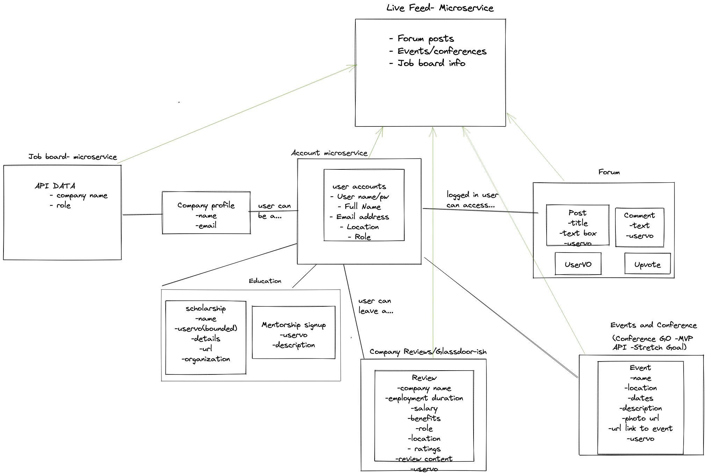

# Women in Tech Social!

## Design

* [API design](docs/apis.md)
* [Data model](docs/data-model.md)
* [GHI](docs/ghi.md)
* [Integrations](docs/integrations.md)

## Architecture

Team Members:
* Amanda Kiehm
* Allisha Rectspat
* Starr Solis
* Rachael Schlosberg
* Cise Babatasi

The social media application for women interested in tech to connect and share ideas.

## Intended market

The people that we expect to use this are
women/girls and gender expansive individuals who are involved or interested in the tech industry. 
These may include (but are not limited to):

* Companies looking to hire
* Tech conference, meet-up or event organisers or participants
* Job seekers
* Tech industry influencers
* Tech mentors/mentees
* Businesses, educational institutions and non-profit organizations

## Functionality

## Must Have Features:
* User accounts (profile, signup, log-in), messaging, followers - personal or business account
* Company info and reviews
* Mentorship / sponsorship / scholarship section
* Job board - query data from Indeed/Glassdoor or other source
* Conference/meetup/event section - query from event API
* Forum for users to post and comment

* (To come later) Personalized Live Feed (homepage) 
* Site search

## Nice to Haves: 
* Newsletter
* Following/follower capability

